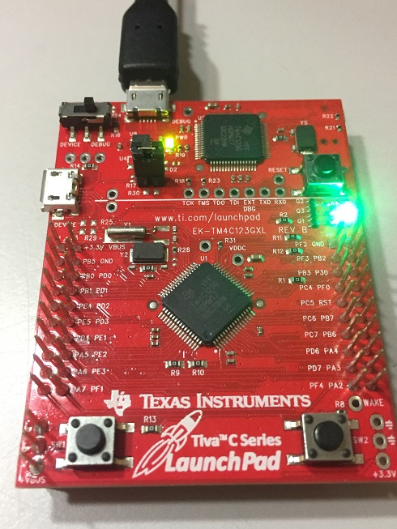
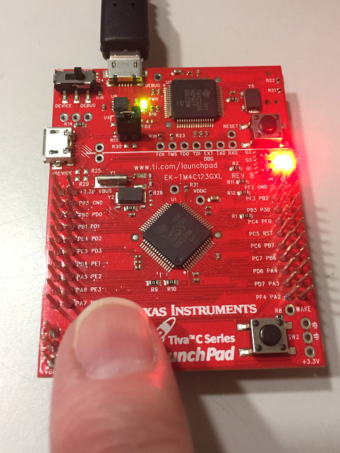

# Blinky Demo

This project is a port of the Blinky basic demo from the FreeRTOS WIN32-MSVC portable folder, to run on the Tiva C Series EK-TM4C123GXL LaunchPad.  

[Step-by-Step Writeup: FreeRTOS for Tiva C TM4C123x - Keil Project Setup](Tutorial-FreeRTOS-Setup.pdf)

